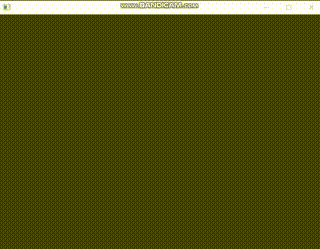

# ofDot
ofDotは`data/dot.json`のJSONをもとに球体の点群を描画します。   
ホットリロード機能を持っており、JSONが書き換わると描画も更新されます。

## コーディング
ofDotを起動した状態で`scratch`フォルダ以下の`draw.js`を使用することでかんたんに描画用のJSONを生成できます。   
`npm run watch`すると`draw.js`を書き換えるたびにJSONが再生成されます。
````.js
const fs = require('fs');
const dot = require('./dot');

const draw = (drawCommands, cameraCommands) => {
    //
    // ここに描画、カメラ制御のコードを書きます。
    //
    cameraCommands.push(dot.cameraPosition({x: 0, y: 0, z: -20}));
    let id = 0;
    for(let x=-10; x<10; x++) {
        for(let y=-10; y<10; y++) {
            drawCommands.push(
                dot.dot(id, {x, y, z: 0}, {x: 1, y: 1, z: 1}, {x: 1, y: 1, z: 0})
            );
            id++;
        }
    }
    // 全ての球体の色を同時に変える
    id = 0;
    const colorChangeCommands = [];
    for(let x=-10; x<10; x++) {
        for(let y=-10; y<10; y++) {
            colorChangeCommands.push(
                dot.colorTo(id,
                    {x: 1, y: 1, z: 0},
                    {x: 0, y: 1, z: 1},
                    1.0)
                );
            id++;
        }
    }
    drawCommands.push(dot.parallel(colorChangeCommands));
}

const main = () => {
    const drawCommands = [];
    const cameraCommands = [];
    draw(drawCommands, cameraCommands);
    console.log('update')
    return JSON.stringify(
        {
            "queues": [
                {
                    commands: drawCommands
                },
                {
                    commands: cameraCommands
                }
            ]
        }
    , null, "\t");
}

fs.writeFileSync("../bin/data/dot.json", main());
module.exports = { main }
````

